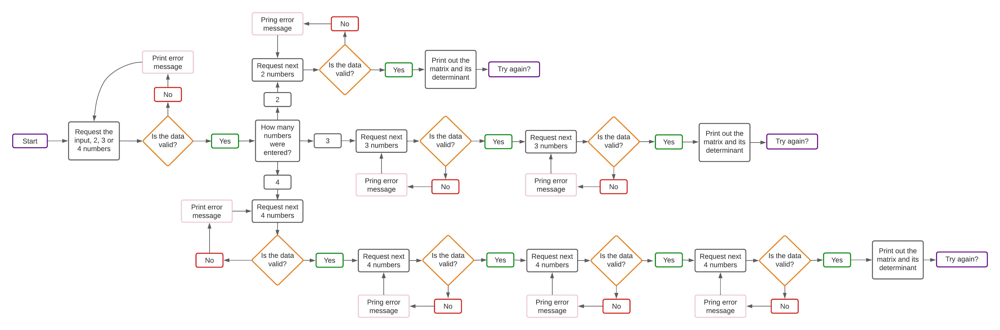
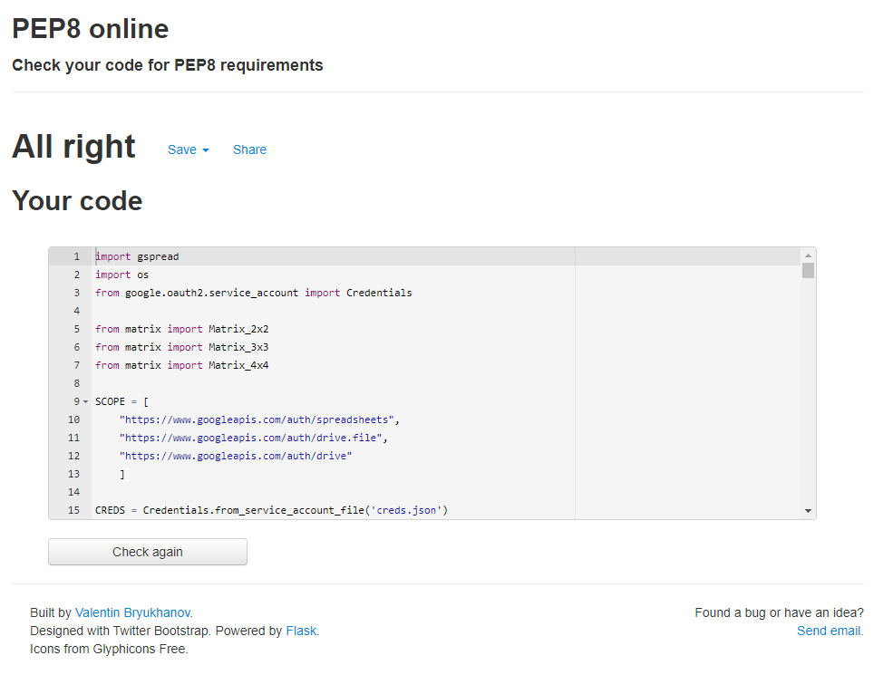
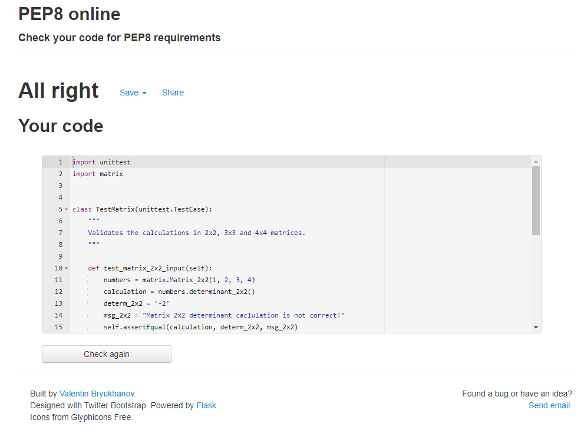
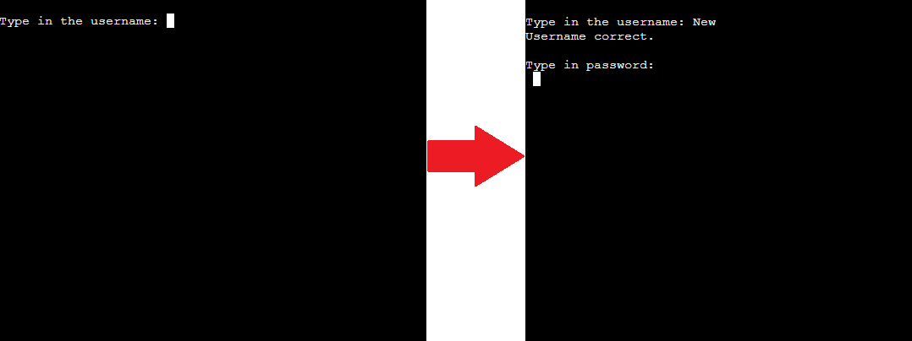
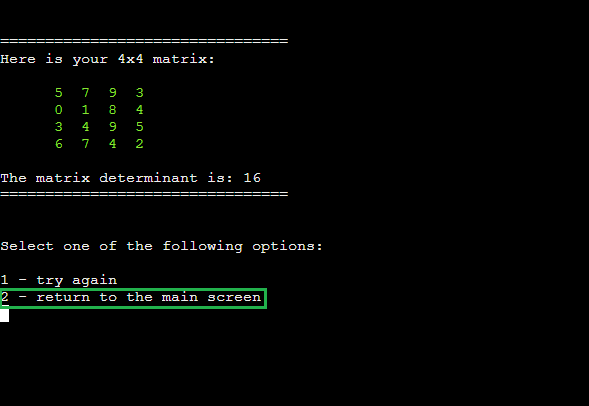

# Enter The Matrix

**Developer: Igor Vasiljev**

[Link to the live project](https://type-the-matrix.herokuapp.com/)

## About

'Enter the Matrix' program accepts a user input of 2, 3 or 4 lines of numbers, then builds and returns the matrix and its determinant.
The program also allows to create a unique user login and password.

The tool's objective is to help the user with math calculations of finding 2x2, 3x3 or 4x4 matrix determinant.

## Table of Contents
  - [Project Goals](#project-goals)
    - [User Goals](#user-goals)
    - [Site Owner Goals](#site-owner-goals)
  - [User Experience](#user-experience)
    - [Target Audience](#target-audience)
    - [User Requirements and Expectations](#user-requirements-and-expectations)
    - [User Manual](#user-manual)
  - [User Stories](#user-stories)
    - [Users](#users)
    - [Site Owner](#site-owner)
  - [Technical Design](#technical-design)
    - [Flowchart](#flowchart)
  - [Technologies Used](#technologies-used)
    - [Languages](#languages)
    - [Frameworks & Tools](#frameworks--tools)
    - [Libraries](#libraries)
  - [Features](#features)
  - [Validation](#validation)
  - [Testing](#testing)
    - [Manual Testing](#manual-testing)
    - [Automation Testing](#automation-testing)
  - [Bugs](#bugs)
  - [Deployment](#deployment)
  - [Credits](#credits)
  - [Acknowledgements](#acknowledgements)

## Project Goals

### User Goals

- Ability to create an account.
- Run math calculations and get the results.

### Site Owner Goals

- Create a useful tool with clear and understandable objectives.
- Easy to use, user-friendly and intuitive navigation.

## User Experience

### Target Audience

- Everyone who's aware of what matrices and their determinants are.

### User Requirements and Expectations

- Easy navigation.
- Clear program response to the user input.
- Non-bulky texts.
- Correct math results of the program.

### User Manual

Click here to view instructions

### Main Screen
On the main screen menu the program logo is displayed, and the user will have 2 options here - create a new username or use an existing login information.

Options:
- create username
- login

### Create username
First, the user has an input line to enter a new username. 

Input name:
- Please type in a new username

If an existing username is entered, then the program will notify the user about it and ask to enter another user name, or return to the main screen.

Options:
- retry new username
- return to the main screen

Once the user name is created, the program will ask you to enter a password. If the program is terminated at this point, then the username will be purged from the data base on the next run.

Input password:
- Please type in a new password

When a user name and password are created, the user can either login or return to the main screen.

Options:
- login
- return to the main screen

### Login
Login option can be used when the user has created the user name and password.

Input:
- Type in the username

If the user name entered is incorrect, the program will notify the user and give 2 options:

- retry login
- return to the main screen

In case if user name is entered correctly, then the user is asked to type in the password:

- Type in password

And if the password is entered incorrectly, the user will need to start the authentication process from the beginning:

- retry login
- return to the main screen

### Login successful
When the user successfully logs in, the information window will be displayed with a brief description of how to use the program and the example. Apart from that there 2 options:

- start
- return to the main screen

### Start
Once the program has started the user is advised to enter 2, 3 or 4 numbers, separated by a comma. If the input is invalid, the corresponding error message will be returned.
If 2 numbers are entered first, then the program will request another 2 numbers in the next input. As before, in case of incorrect input the error message will be returned. Same for 3 and 4 numbers.

Once the final batch of numbers is entered, the program will process the overall input and return the matrix and calculate its determinant using the corresponding math formulas.

The program will ask if the user wishes to run the program again, or return to the main screen:

- try again
- return to the main screen

[Back to Table Of Contents](#table-of-contents)

## User Stories

### Users

1. As a user I want to select to create a new user name or use the existing.
2. I want to have functionality to create a new user name and password.
3. I want to have the ability to use existing user name and password.
4. I want to have a clear understanding of what went wrong in the case of error.
5. I want to have understandable, non-bulky instructions of use.
6. I want to be able to easily navigate from any point in the program to the main screen.
7. I want to run the program and get the correct results based on my input.
8. I want to have the ability to repeat the program multiple times without re-logging.

### Site Owner

9. As a site owner, I want the users to have a perfect understanding of what the program does.
10. I want the login details saved to the spreadsheet.
11. I want the data to be correctly validated and the correct results are returned.

[Back to Table Of Contents](#table-of-contents)

## Technical Design

### Flowchart
The following flowchart represents the matrix input and calculation program logic:

Flowchart

## Technologies Used

### Languages

- [Python](https://www.python.org/) as the programming language

### Frameworks & Tools

- [GitHub](https://github.com/) as a repository for the project code
- [Google Cloud Platform](https://console.cloud.google.com/) to access and manipulate data on spreadsheets
- [Google Sheets](https://docs.google.com/) to store the authentification details
- [PEP8](http://pep8online.com/) to validate the code
- [Heroku](https://www.heroku.com/) to deploy the project

### Python Libraries

- [unittest](https://docs.python.org/3/library/unittest.html)
- os - to clear the console

#### Third Party Libraries

- [gspread](https://docs.gspread.org/) - Justification: gspread was used to manipulate data on the Google spreadsheet.
- [google.oauth2.service_account](https://google-auth.readthedocs.io/en/master/) - Justification: Google OAuth was used to access Google API with the information generated in creds.json file. This information is also used in the deployment to Heroku.

[Back to Table Of Contents](#table-of-contents)

## Features

### Main screen

- Welcome message is displayed.
- 2 options to select from:
  - create username
  - login

Show main screen screenshot

### Create a new username

- A new username input is displayed.

Show new username creation screenshot

### Existing username login

- Existing username input is displayed.

Show existing username login screenshot

### Instructions

- Instructions on how to use the program are displayed.
- 2 options to select from:
  - start
  - return to the main screen

Show instructions screenshot 1

Show instructions screenshot 2

### Enter the numbers

- A message suggesting to enter 2, 3 or 4 numbers is displayed.

Show enter the number screenshot

### Results

- Matrix and its determinant are displayed.
- 2 options to select from:
  - try again
  - return to the main screen

Show results screenshot

### User Input Validation

- An error message is displayed when incorrect symbol is entered in 1-2 menu selections.

Show the error screenshot

- An error message is displayed when the number lines are entered in incorrect format.

Show the error screenshot

Show the error screenshot

- An error message is shown when using incorrect user name on login.

Show the error screenshot

- Another error message is displayed when using an existing username on username creation.

Show the error screenshot

[Back to Table Of Contents](#table-of-contents)

## Validation

[PEP8 online](http://pep8online.com/) was used to check the code for errors. Code passed validation in all files.

run.ry validation

matrix.ry validation

tests.ry validation

## Testing

The project was tested using 2 methods:
- Manually
- Unit testing

### Manual Testing

User stories testing

1. As a user I want to select to create a new user name or use the existing.

| **Feature**   | **Action**                    | **Expected Result**          | **Actual Result** |
| ------------- | ----------------------------- | ---------------------------- | ----------------- |
| Main screen | Select 'create username' | Navigate to new user creation screen | Works as expected |
| Main screen | Select 'login' | Navigate to existing user login | Works as expected |
| Main screen | Enter any symbol that is not 1 or 2 | Return the correct error message | Works as expected |

Screenshot 1

Screenshot 2

Screenshot 3

2. I want to have functionality to create a new user name and password.

| **Feature**   | **Action**                    | **Expected Result**          | **Actual Result** |
| ------------- | ----------------------------- | ---------------------------- | ----------------- |
| New username | Enter existing username | Return error and show navigation options | Works as expected |
| New username | Enter non-existing username | Navigate to password selection | Works as expected |
| New username | Terminate the program without setting a password | The username entered will be deleted | Works as expected |
| New username | Login using new username and password | Navigate to the instructions screen | Works as expected |
| New username | Use incorrect login details | Return error and show navigation options  | Works as expected |

Screenshot 1

Screenshot 2

Screenshot 3

Screenshot 4

3. I want to have the ability to use existing user name and password.

| **Feature**   | **Action**                    | **Expected Result**          | **Actual Result** |
| ------------- | ----------------------------- | ---------------------------- | ----------------- |
| Existing username | Enter non-existing username | Return error and show navigation options | Works as expected |
| Existing username | Enter existing username | Navigate to password selection | Works as expected |
| Existing username | Enter incorrect password | Return error and show navigation options | Works as expected |
| Existing username | Enter correct password | Navigate to the instructions screen | Works as expected |

Screenshot 1

Screenshot 2

Screenshot 3

Screenshot 4

4. I want to have a clear understanding of what went wrong in the case of error.

| **Feature**   | **Action**                    | **Expected Result**          | **Actual Result** |
| ------------- | ----------------------------- | ---------------------------- | ----------------- |
| Generic | Enter any symbol that is not 1 or 2 in the 1-2 selection | Return the correct error and description | Works as expected |
| Entering the matrix | Enter 3 numbers when 2 or 4 were requested | Return the correct error and description | Works as expected |
| Entering the matrix | Enter any letter(s) | Return the correct error and description | Works as expected |

Screenshot 1

Screenshot 2

Screenshot 3

5. I want to have understandable, non-bulky instructions of use.

| **Feature**   | **Action**                    | **Expected Result**          | **Actual Result** |
| ------------- | ----------------------------- | ---------------------------- | ----------------- |
| Instructions | Navigate to instructions screen | All text is perfectly aligned and readable | Works as expected |
| Results screen | Enter the numbers and get the results | All text is perfectly aligned and readable | Works as expected |

Screenshot 1

Screenshot 2

6. I want to be able to easily navigate from any point in the program to the main screen.

| **Feature**   | **Action**                    | **Expected Result**          | **Actual Result** |
| ------------- | ----------------------------- | ---------------------------- | ----------------- |
| Incorrect user name | Enter an incorrect username | There is an option to navigate to the main screen | Works as expected |
| Incorrect password | Enter an incorrect password | There is an option to navigate to the main screen | Works as expected |
| Instructions | Navigate to instructions screen | There is an option to navigate to the main screen | Works as expected |
| Results | Run the program and get to results screen | There is an option to navigate to the main screen | Works as expected |

Screenshot 1

Screenshot 2

Screenshot 3

Screenshot 4

7. I want to run the program and get the correct results based on my input.

| **Feature**   | **Action**                    | **Expected Result**          | **Actual Result** |
| ------------- | ----------------------------- | ---------------------------- | ----------------- |
| Start the matrix calculation | Enter 2,3 or 4 number lines | The program requests the correct amount of numbers | Works as expected |
| Results | Enter 2,3 or 4 number lines | The program returns the correct determinant value | Works as expected |

Screenshot 1

Screenshot 2

8. I want to have an ability to repeat the program multiple times without re-logging.

| **Feature**   | **Action**                    | **Expected Result**          | **Actual Result** |
| ------------- | ----------------------------- | ---------------------------- | ----------------- |
| Results | Use 'Try again' function | The matrix input function restarts | Works as expected |

Screenshot 1

9. As a site owner, I want the users to have a perfect understanding of what the program do.

| **Feature**   | **Action**                    | **Expected Result**          | **Actual Result** |
| ------------- | ----------------------------- | ---------------------------- | ----------------- |
| Main screen | Show informational messages | Clear description of the program functions | Works as expected |
| Instructions | Show informational messages | Clear description of how to use the program | Works as expected |
| Results | Show informational messages | Clear outcome of the user input | Works as expected |

Screenshot 1

Screenshot 2

Screenshot 3

10. I want the login details saved to the spreadsheet.

| **Feature**   | **Action**                    | **Expected Result**          | **Actual Result** |
| ------------- | ----------------------------- | ---------------------------- | ----------------- |
| Create a new user name | Enter a new username | The new user name gets saved on the spreadsheet | Works as expected |
| Create a new user name | Enter a new password | The new password gets saved on the spreadsheet against the new user name| Works as expected |
| Create a new user name | Enter a new username and exit the program | The user name without a password gets purged from the spreadsheet | Works as expected |

11. I want the data to be correctly validated and the correct results are returned.

| **Feature**   | **Action**                    | **Expected Result**          | **Actual Result** |
| ------------- | ----------------------------- | ---------------------------- | ----------------- |
| Login | Enter the correct username | The correct message is displayed and password is requested | Works as expected |
| Login | Enter the correct password | Log in and navigate to the instructions screen | Works as expected |
| Create a new username | Enter non-existing username | The correct message is displayed and password is requested | Works as expected |
| Create a new username | Enter a password | The correct navigation options are displayed | Works as expected |

Screenshot 1

### Automation Testing

Unit testing

1. Unit tests were written using 'unittest' library.
2. Tests are designed to check matrix determinant calculations.
3. assertEqual() method was used to make sure the results are returned as per input.

Unit test pass scenario

Unit test fail scenario

[Back to Table Of Contents](#table-of-contents)

## Bugs

| **Bug** | **Fix** |
| ------- | ------- |
| Login and password column headers in the spreadsheet worked as credentials for login | Remove the 'login' and 'password' headers from the spreadsheet |
| Unable to login if using an existing password | Function that matches password against the username is amended |
| Only login is added to the spreadsheet when terminating the program after new user name input | Function added to remove the username if there is no password for it |
| New login and password overriding the existing ones | Function that looks for the last empty row in the spreadsheet was fixed |
| Unexpected square brackets displayed in the matrix output | Added replace() method to the matrix output function |
| Text issues decreasing readability | Line breaks added and removed overflowing equal signs |

## Deployment

### Heroku

The project was deployed using Heroku by the following steps:

1. Create or log in to your account at heroku.com
2. Click 'New' -> 'Create new app'
3. Type in the app name (current project name is 'type-in-matrix') -> select the region -> 'Create app'
4. Navigate to 'Settings' tab
5. Click 'Reveal Config Vars' -> Add 'CREDS' key -> paste the content of creds.json file to 'value field -> 'Add'
6. Add one more config var with the key 'PORT' and value '8000'
7. Then click 'Add buildpack' -> add 'python' -> add 'nodejs'
8. Navigate to 'Deploy' tab
9. Select 'GitHub' in the 'Deployment method' area
10. Enter the GitHub repository name in the search bar -> 'Connect'
11. Click 'Deploy Branch' and wait for it to be built

### Making a Local Clone

1. Navigate to the GitHub repository 
2. Click the 'Code' button (next to the green 'Gitpod' button)
3. Copy the HTTPS link
4. Navigate to Git Bash -> working directory
5. Type 'git clone' and paste the URL received in step 3
6. Press 'Enter

[Back to Table Of Contents](#table-of-contents)

## Credits

- [Messletters text generator](https://www.messletters.com/en/) was used to create the program logo.
- [gspread](https://docs.gspread.org/en/latest/index.html) was used to get an examples of module usage.
- [Stack overflow](https://stackoverflow.com) was used to find answers related to the correct syntax use.