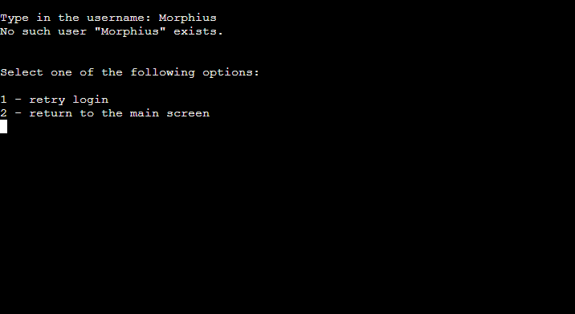
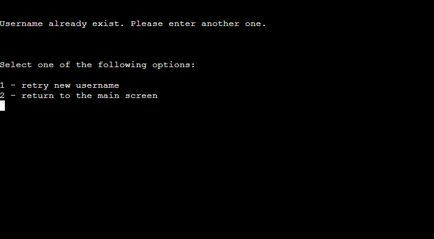

# Enter The Matrix

**Developer: Igor Vasiljev**

[Link to the live project](https://type-the-matrix.herokuapp.com/)

## About

'Enter the Matrix' program accepts a user input of 2, 3 or 4 lines of numbers, then builds and returns the matrix and its determinant.
The program also allows to create a unique user login and password.

The tool's objective is to help the user with math calculations of finding 2x2, 3x3 or 4x4 matrix determinant.

## Table of Contents
  - [Project Goals](#project-goals)
    - [User Goals](#user-goals)
    - [Site Owner Goals](#site-owner-goals)
  - [User Experience](#user-experience)
    - [Target Audience](#target-audience)
    - [User Requirements and Expectations](#user-requirements-and-expectations)
    - [User Manual](#user-manual)
  - [User Stories](#user-stories)
    - [Users](#users)
    - [Site Owner](#site-owner)
  - [Technical Design](#technical-design)
    - [Flowchart](#flowchart)
  - [Technologies Used](#technologies-used)
    - [Languages](#languages)
    - [Frameworks & Tools](#frameworks--tools)
    - [Libraries](#libraries)
  - [Features](#features)
  - [Validation](#validation)
  - [Testing](#testing)
    - [Manual Testing](#manual-testing)
    - [Automated Testing](#automated-testing)
  - [Bugs](#bugs)
  - [Deployment](#deployment)
  - [Credits](#credits)
  - [Acknowledgements](#acknowledgements)

## Project Goals

### User Goals

- Ability to create an account.
- Run math calculations and get the results.

### Site Owner Goals

- Create a useful tool with clear and understandable objectives.
- Easy to use, user friendly and intuitive navigation.

## User Experience

### Target Audience

- Everyone who's aware of what matrices and their determinants are.

### User Requirements and Expectations

- Easy navigation.
- Clear program responce to the user input.
- Non-bulky texts.
- Correct math results of the program.

### User Manual

Click here to view instructions

### Main Screen
On the main screen menu the program logo is displayed, and the user will have 2 options here - create a new username or use an existing login information.

Options:
- create username
- login

### Create username
First the user has an input line to enter a new username. 

Input name:
- Please type in a new username

If existing username is entered, then the program will notify the user about it and ask to enter another user name, or return to the main screen.

Options:
- retry new username
- return to the main screen

Once the user name is created, the program will ask to enter a password. If the program will be terminated at this point, then the username will be purged from the data base on the next run.

Input password:
- Please type in a new password

When user name and password are created, the user can either login or return to the main screen.

Options:
- login
- return to the main screen

### Login
Login option can be used when the user has created the user name and password.

Input:
- Type in the username

If the user name entered is incorrect, the program will notify the user and give 2 options:

- retry login
- return to the main screen

In case if user name is entered correctly, then the user is asked to type in the password:

- Type in password

And if the password is entered incorrectly, the user will need to start authentication process from the beginning:

- retry login
- return to the main screen

### Login successful
When the user successfully logs in, the information window will be displayed with a brief description of how to use the program and the example. Apart from that there 2 options:

- start
- return to the main screen

### Start
Once the program started the user is advised to enter 2, 3 or 4 numbers, separated by comma. If the input is invalid, the corresponding error message will be returned.
If 2 numbers are entered first, then the program will request another 2 numbers in the next input. As before, in case of incorrect input the error message will be returned. Same for 3 and 4 numbers.

Once the final batch of numbers is entered, the program will process the overall input and return the matrix and calculate its determinant using the corresponding math formulas.

The the program will ask if user wishes to run the program again, or return to the main screen:

- try again
- return to the main screen

## User Stories

### Users

1. As a user I want to select to create a new user name or use the existing.
2. I want to have a functionality to create a new user name and password.
3. I want to have an ability to use existing user name and password.
4. I want to have a clear undestanding of what went wrong in the case of error.
5. I want to have understandable, non-bulky instructions of use.
6. I want to be able to easily navigate from any point of the program to the main screen.

6. I want to run the program and get the correct results based on my input.
7. I want to have an ability to repeat the program multiple times without re-logging.

### Site Owner

1. As a site owner I want the users to have a perfect understanding of what the program do.
2. I want the users to have positive experience.
3. I want the users to avail from the program math functionality.

## Technical Design

### Flowchart
The following flowchart represents the matrix input and calculation program logic:

Flowchart

## Technologies Used

### Languages

- [Python](https://www.python.org/) as the programming language

### Frameworks & Tools

- [GitHub](https://github.com/) as a repository for the project code
- [Google Cloud Platform](https://console.cloud.google.com/) to access and manipulate data on spreadsheets
- [Google Sheets](https://docs.google.com/) to store the authentification details
- [PEP8](http://pep8online.com/) to validate the code
- [Heroku](https://www.heroku.com/) to deploy the project

### Libraries

- [gspread](https://docs.gspread.org/) to manipulate the data on spreadsheet
- [unittest](https://docs.python.org/3/library/unittest.html) to create unit tests for matrix calculations
- [google.oauth2.service_account](https://google-auth.readthedocs.io/en/master/) to create json authentification file
- os - to clear the console

## Features

### Main screen

- Welcome message is displayed.
- 2 options to select from:
  - create username
  - login

Show main screen screenshot

### Create a new username

- A new username input is displayed.

Show new username creation screenshot

### Existing username login

- Existing username input is displayed.

Show existing username login screenshot

### Instructions

- Instructions of how to use the program are displayed.
- 2 options to select from:
  - start
  - return to the main screen

Show instructions screenshot 1

Show instructions screenshot 2

### Enter the numbers

- A message suggesting to enter 2, 3 or 4 numbers is displayed.

Show enter the number screenshot

### Results

- Matrix and its determinant are displayed.
- 2 options to select from:
  - try again
  - return to the main screen

Show results screenshot

### User Input Validation

- An error message is displayed when incorrect symbol is entered in 1-2 menu selections.

Show the error screenshot

- An error message is displayed when the number lines are entered in incorrect format.

Show the error screenshot

Show the error screenshot

- An error message is shown when using incorrect user name on login.

Show the error screenshot

- Another error message is displayed when using existing username on username creation.

Show the error screenshot

## Testing

The project was tested using 2 methods:
- Manually
- Unit testing

### Manual Testing

User stories testing

1. As a user I want to select to create a new user name or use the existing.

| **Feature**   | **Action**                    | **Expected Result**          | **Actual Result** |
| ------------- | ----------------------------- | ---------------------------- | ----------------- |
| Main screen | Select 'create username' | Navigate to new user creation screen | Works as expected |
| Main screen | Select 'login' | Navigate to existing user login | Works as expected |
| Main screen | Enter any symbol that is not 1 or 2 | Return error message | Works as expected |

2. I want to have a functionality to create a new user name and password.

| **Feature**   | **Action**                    | **Expected Result**          | **Actual Result** |
| ------------- | ----------------------------- | ---------------------------- | ----------------- |
| New username | Enter existing username | Return error and show navigation options | Works as expected |
| New username | Enter non-existing username | Navigate to password selection | Works as expected |
| New username | Terminate the program without setting a password | The username entered will be deleted | Works as expected |
| New username | Login using new username and password | Navigate to the instructions screen | Works as expected |
| New username | Use incorrect login details | Return error and show navigation options  | Works as expected |

3. I want to have an ability to use existing user name and password.

| **Feature**   | **Action**                    | **Expected Result**          | **Actual Result** |
| ------------- | ----------------------------- | ---------------------------- | ----------------- |
| Existing username | Enter non-existing username | Return error and show navigation options | Works as expected |
| Existing username | Enter existing username | Navigate to password selection | Works as expected |
| Existing username | Enter incorrect password | Return error and show navigation options | Works as expected |
| Existing username | Enter correct password | Navigate to the instructions screen | Works as expected |

4. I want to have a clear undestanding of what went wrong in the case of error.

| **Feature**   | **Action**                    | **Expected Result**          | **Actual Result** |
| ------------- | ----------------------------- | ---------------------------- | ----------------- |
| Generic | Enter any symbol that is not 1 or 2 in the 1-2 selection | Return the correct error and description | Works as expected |
| Entering the matrix | Enter 3 numbers when 2 or 4 were requested | Return the correct error and description | Works as expected |
| Entering the matrix | Enter any letter(s) | Return the correct error and description | Works as expected |

5. I want to have understandable, non-bulky instructions of use.

| **Feature**   | **Action**                    | **Expected Result**          | **Actual Result** |
| ------------- | ----------------------------- | ---------------------------- | ----------------- |
| Instructions | Navigate to instructions screen | All text is perfectly aligned and readable | Works as expected |

6. I want to be able to easily navigate from any point of the program to the main screen.

| **Feature**   | **Action**                    | **Expected Result**          | **Actual Result** |
| ------------- | ----------------------------- | ---------------------------- | ----------------- |
| Instructions | Navigate to instructions screen | All text is perfectly aligned and readable | Works as expected |

